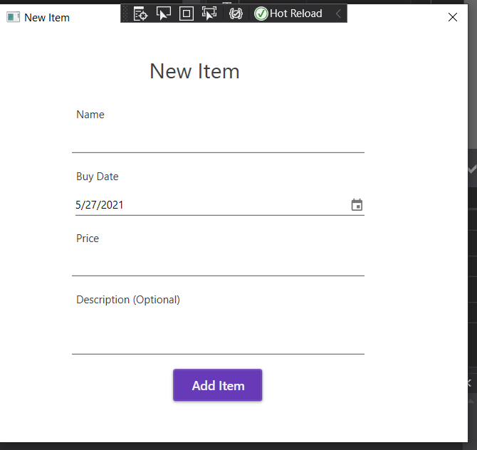

# BudgetPlanner
WPF Windows application used to plan your monthly budget.

# Development team:

* Opra Andrei
* Ciucur Daniel

# Functionality

* Set monthly budgets for different types of categories (bills, groceries, economies, ...)
* Add you expenses
* View all your expenses
* Group your expenses into categories
* Currency convertor (using an API)

# User manual

Below we will take a look at the interfaces and functionalities that our app has.

## Register screen

This is the register screen, here you can register for a new account.

## Login screen
This is the login screen, here you can login in order to access the app.

## Home screen

This is the homescreen, here you will see a menu in the left where you can navigate to other parts of the app. In the middle you will see a list of your categories of expenses, you can of course add new ones or delete them. If you click an expense category you can log and see your expenses from that category.

## Currency converter screen

This is the currency converter window, from here you can perform currency convertions, you will get tha rate in real time via an API.

## Expenses list screen

Here you can (after you click an expense category) you can see all expenses (belonging to the previously clicked category) that you made so far. You can perform different operations like sorting, adding, deleting.

## Add new item screen

From here you can add a new item that you bought, which belongs to the categoty that you are currently in. 

## Budget status window

Here you can see a pie chart representing the status of your spendings. 
Note: The NuGet package with the chart has some bugs, sometimes puts a color more than once in a chart.

